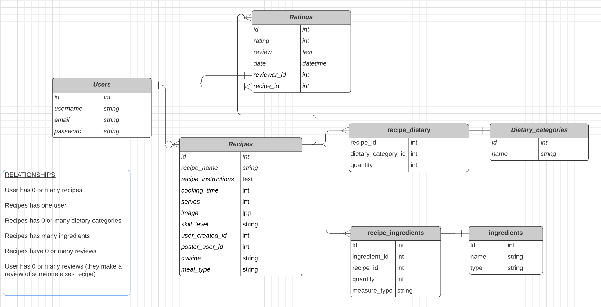
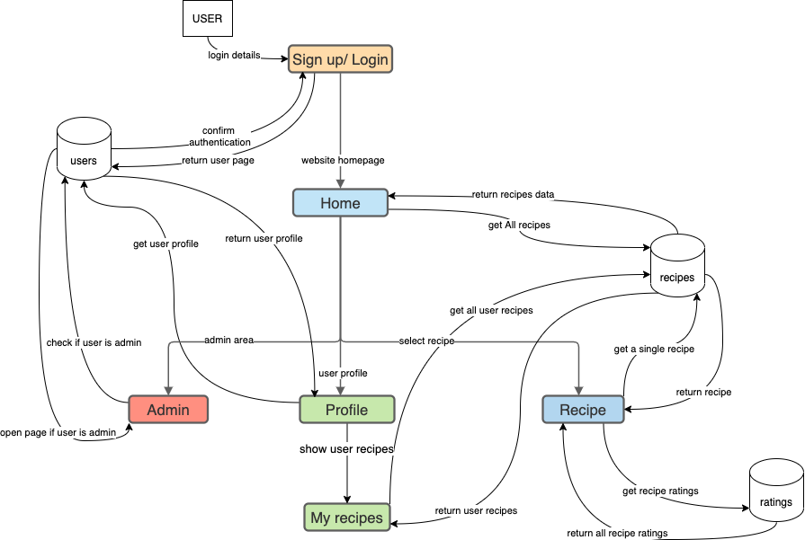
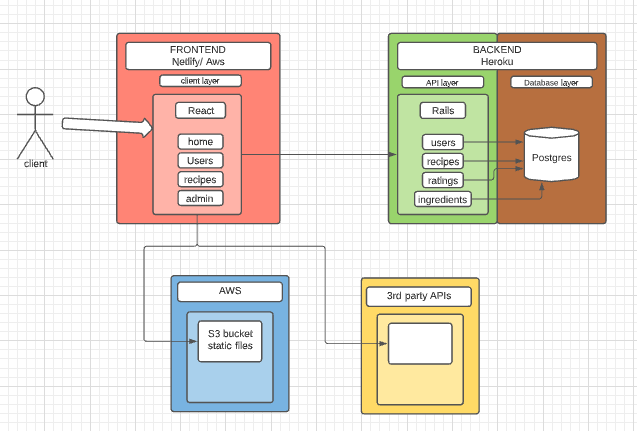

# THE FOOD CONNECTION <!-- omit in toc --> 

 

## T3A2 - PART A <!-- omit in toc --> 

## Suzanne Topp & Vanessa Denardin <!-- omit in toc --> 

## CODER ACADEMY July 2021 <!-- omit in toc --> 

---

**FULL STACK WEB APPLICATION DOCUMENTATION** <!-- omit in toc --> 

## CONTENTS <!-- omit in toc --> 

- [PURPOSE](#purpose)
- [FUNCTIONALITY](#functionality)
- [FEATURES](#features)
- [TARGET AUDIENCE](#target-audience)
- [TECH STACK](#tech-stack)
- [ERD](#erd)
- [DATAFLOW DIAGRAM](#dataflow-diagram)
- [APPLICATION ARCHITECTURE DIAGRAM](#application-architecture-diagram)
- [USER STORIES](#user-stories)
- [WIRE FRAMES](#wire-frames)
- [PLANNING OVERVIEW](#planning-overview)
- [PROJECT MANAGEMENT SCREENSHOTS AND DIARY](#project-management-screenshots-and-diary)

---

## PURPOSE

‘The Food Connection’ ……. Food for Everyone.

When thinking about a business model for a web application, we discussed the things that have hit society the most in the last 2 years.  COVID19 changed the way many Australians think about being home together, and what you can do as a family or friend unit that creates joy and positivity.  The answer to that has revolved around food.  If you search online Tik Tok and YouTube are filled with beautiful videos where people make food for you to either make it along with them, or to just relax watching.  Our idea for ‘The Food Connection’ was born from this need for connection in your kitchen at home, where you might be cooking alone, or not be able to order in food for something special to brighten your week.

We wanted to create a place where you could store your favourite recipes, and refer to them easily later.  Where you can house your ancient family recipes that mean so much, and allow your friends and family to sign up and access them easily too. 

There are other applications around online currently that offer similar services to what we want to offer, but we found they have an Ecommerce approach, where the main goal is to sell a product. ‘The Food Connection’ is about the connection food brings between people, and how important that can be for people that are struggling with isolation or are unable to go out and buy food easily.  Using what you have in your pantry to create something your family can enjoy is priceless.  

Our goal is to create a place where you can save and use your own recipes, but also take inspiration from other recipes you may have never seen.  Whether it’s a stranger from another country, or your friends and family, you can find recipes to try out without feeling the pressure of needing to purchase anything.

Enjoy The Connection of Food.....

---

## FUNCTIONALITY

- *Website usability* - allows the user to visit different pages that bring different content on the same theme.

- *Navigation function* - located at the top of the browser's page, a navigation bar should allow users to discover the site and easily find what they want.

- *Navigation function for mobile* - as on a mobile device, it is more difficult to show the full main menu due to the screen size, the hamburger menu function allows to encapsulate the main menu content, showing only the full main menu when the user clicks on it.

- *Search function* - to help users who know exactly what they're looking for on the site, allowing them to take control of their site experience.

- *Call-to-Action button* - add buttons to pages, guiding visitors on what to do next and helping them on their journey through the site.

- *Logo* - easy-to-remember visual images that provide users to make a link between the site and that image.

- *Rating* - including a review/rating section after posting the recipe, allowing visitors to interact in a discussion that shows how the recipe was made by other users in their homes.

- *Easily readable* - use fonts that allow visitors to read the content more easily.

- *Mobile responsiveness* - as more and more users access the Internet through their mobile devices, a website needs to show screens of all sizes and functionality working properly.

- *Contrast colors scheme* - considering the right contrast between background and site content makes the content easier to read, which positively contributes to the user experience.

- *Forms* - allow users to interact with the site, whether registering, adding a new recipe, editing, rating and reviewing the recipe, as they are easy to use and accessible to all users.

- *Banner image/ Images* - header image or body image giving visitors a visual as images hold attention by being easier to handle than large text.

- *Homepage using card design* - distribute info in a visual way to client/visitor easily consume part of the content.

- *Footer* - features secondary navigation, contact information, social media links.

---

## FEATURES

- *Sign up page* - personalized registration page to facilitate user access and better use of the site.

- *User registration* - make easier user interaction with the website.

- *Login page* - customized login page for quick and easy user access.

- *Homepage* - all recipes added to the site and a banner showing a random recipe every day.

- *Recipe page* - single recipe information provides in detail the author's name and ratings, if available.

- *My recipes page* - set of recipes added by logged in user providing options for updating information.

- *Nav bar* - displays available pages at the top of all pages for easy access on the site

- *Hamburger menu on mobile site* - keeping cleaner and organizing menu display for small screens.

- *Author's name* - visitors occasionally want to know more about the user writing the recipe, this creates a connection to the user on the other end, potentially encouraging a return for a new recipe.

- *Rating page* - include some things users have said about the rated recipes posted on the site.

- *Search bar* - search feature helping the user to explore the site.

- *Select by category* - feature helping user personalize the search in the site.

- *Call-to-Action buttons in all pages* - in "subscribe", "add a new recipe", "visit the recipes page", "evaluate a recipe" guiding users on their journey through the site

- *Homepage banner image of th recipe of the week/month* - homepage header image of a random recipe to holds users atention.

- *Homepage image cards* - list of all site recipes presented as a picture card to arouse user interest.

- Bootstrap UI

---

## TARGET AUDIENCE

Due to the covid-19 pandemic, everyday life changed completely, especially in regions where lockdowns were implemented to try to cease the spread of the virus. Then countless people lost their jobs or started working or studying from home, some restaurants were affected by going bankrupt or temporarily closing.

These people who had their lives affected began to look for alternatives to save money or to increase the connection between their loved ones at home, one of them was searching on the internet for recipes to cook, to learn to cook, to spend the free time developing a new hobby.

The number of websites or social media pages focused on sharing food recipes has grown in recent months. Although competition is high due to numerous recipe sharing websites, this application does not seek to market recipes, but to benefit users by being like an online cookbook in which the user can not only share their own recipes, but also save recipes from other users, rating and reviewing other recipes.

People who have extra time and want to store family's recipes that they can then find easily later. 

People who would like to share good recipes with others who share the same taste or culture and would like to reduce the stress of the lockdown, cooking a childhood memory that would bring comfort.

People who would like to learn different recipes, as they have more free time or the restaurants in their areas closed. They stay at home with family members during lockdowns and want a variety of meals.

People who look for recipes online and test at home as a hobby, a way of improving cooking skills or just to try new and different flavours.

People who want to innovate in the kitchen cooking different recipes and improve their cooking skills and surprise their family with a new meal.

People who want to research popular recipes between users through comments and ratings to start a new food business.

We want it to be for EVERYONE who loves food.

---

## TECH STACK

**FRONT END** - HTML5, CSS3, REACT, JAVASCRIPT, JSX, BOOTSTRAP

**BACK END** - RUBY ON RAILS, RUBY

**DATABASE** - POSTGRESQL

**DEPLOYMENT** - FRONT END - NETLIFY, BACK END - HEROKU

**TESTING** - BACK END - RSPEC & MANUAL TESTING, FRONT END - JEST AND MANUAL TESTING

**PROJECT MANAGEMENT** - TRELLO FOR TASK MANAGEMENT, GOOGLE DOCS DIARY, FOLDERS AND CHECKLIST FOR MORE PADDED OUT PLANNING

**UTILITIES** - BALSAMIQ, LUCID, DIAGRAMS.NET, COOLORS, FIGMA, UNSPLASH, ICONS8

**DEVOPS** - GIT, GITHUB, VS CODE

---

## ERD

 

---

## DATAFLOW DIAGRAM

 

---

## APPLICATION ARCHITECTURE DIAGRAM

 

---

## USER STORIES

**USERS WANTING TO UPLOAD RECIPES**

As a mom, I want to share my recipes with my children so they can cook at their homes.

As a restaurant owner, I want to share my recipes so the customers of my restaurant can reproduce my best sellers at home.

As a chef, I want to store my recipes so I can make a collection of recipes.

As an international student, I want to store my favourite recipes so I can prepare them when I'm living abroad.

As a family member, I want to store grandma's recipes so that all members of my family can access them.

As a new user, I want to create an account so I can access it often to upload my recipes.

As a user, I want to store my favourite recipe so other users can connect with other users with similar tastes.

As a user, I want to choose the right cuisine so others can understand the background of the recipe.

As a user, I want to easily find the pages available for me so I can understand the website proposal.

As a user, I want to submit my recipe so I can find it on my recipes page.

As a user, I want to see the recipe's rankings so I can choose one to cook tonight.

As a user, I want to save my favourite recipes so I can access them during the week for a variation on dinner.

**USERS WANTING TO FIND A RECIPE**

As a mom, I want to find a recipe so I can cook a different family meal.

As a restaurant owner, I want to find a popular recipe so I can add in my restaurant's menu.

As a chef, I want to find a new recipe so I can improve my skills.

As a student living by myself, I want to find a recipe so I can use the ingredients that I have in the fridge.

As a family member, I want to find a new recipe so I can cook tonight for the family meal.

As a member of a group of friends, I want to find a breakfast recipe so I can make it tomorrow morning for our meeting.

As a new user, I want to create an account so I can visit different recipes.

As a new user, I want to read about the recipe of the week so I can cook during the weekend.

As a user, I want to search for a recipe to find the one that matches my weekend event.

As a user, I want to save the recipe from last night so I can cook it again next month.

As a user, I want to find a recipe that matches my dietary requirements so I can cook a safe dish.

As a user, I want to search for a specific cuisine so I can cook a different meal for my family.

As a user, I want to find a well rated recipe so I can cook something delicious for my family tonight.

As a user I want to search for some dessert so I can prepare something to take to my friend's house tomorrow.

**USERS WANTING TO INTERACT VIA REVIEWS**

As a mom, I want to leave a review so I can share my experience doing that dish.

As a chef, I want to leave a review so I can share useful tips for other users.

As a family member, I want to leave a comment so I can share my family's opinion after eating that dish.

As a student living by myself, I want to leave a comment on my favourite recipes so other users can try to cook it at home.

As a user, I would like to read some reviews of the best recipes on the site so that I can choose the most suitable dish for my dinner.
As a user, I want to select the best recipes so I can cook something delicious at home this weekend.

As a user, I want to save the highly-rated recipe so I can try it at home someday.

**USERS WANTING THE CONNECTION OF REVIEWS**

As a user, I want to read the reviews that others left in my recipes so I can understand their perception.

As a user, I want to see the reviews that I wrote so I can select the ideal dish for tonight.

As a user, I want to know the best review in my recipes' list to prepare me for my weekend event.

As a user, I want to read the comments to get an overview of the perception about the last recipe I added.

**ADMIN**

As the admin, I want to know how many users created an account in the last month so I can understand the success of the website.

As the admin, I want to know how many users have unsubscribed in the last month so I can understand what is failing.

As the admin, I want to understand what users are expecting from the site so I send surveys regularly.

As the admin, I want to disable a user account as the user broke the rules.

---

## WIRE FRAMES

---

## PLANNING OVERVIEW

---

## PROJECT MANAGEMENT SCREENSHOTS AND DIARY

---

© Suzanne Topp & Vanessa Denardin - July 2021 - Coder Academy T3A2 Final Full Stack Group Project
